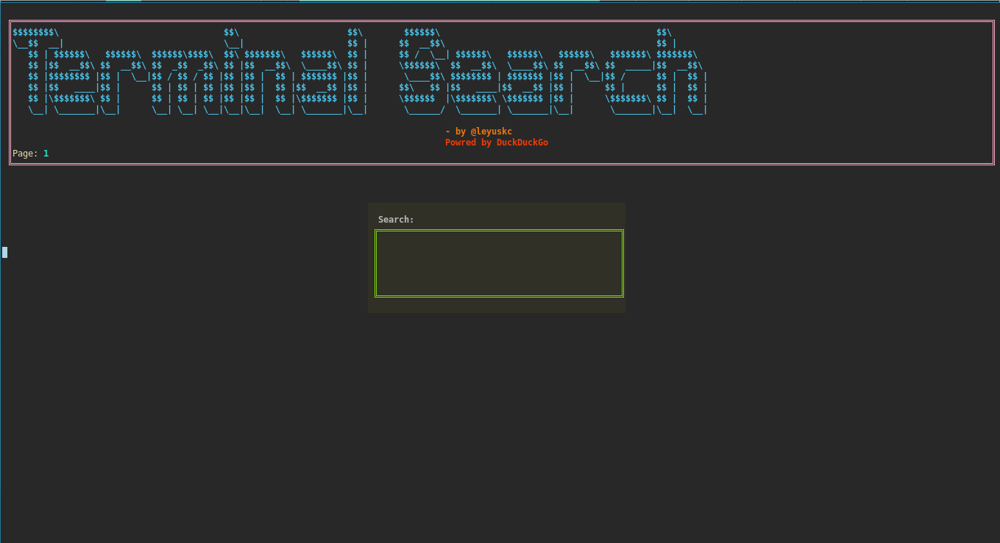
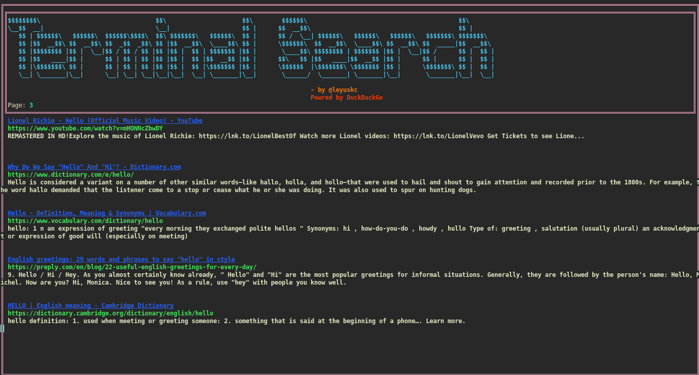

# terminalsearch
This is a CLi tools for devs focused on their productivity. It is fast, light weight and with just one additional module `beautifulsoup` you can do websearches from your terminal and experience different experience.

## Installation
```bash
pip install beautifulsoup4
git clone  https://github.com/leyuskckiran1510/terminalsearch.git
cd terminalsearch
python src/main.py
```

## Images



## Usage
```bash
terminalsearch
```

## Contributing
Pull requests are welcome. For major changes, please open an issue first to discuss what you would like to change.

## License
[MIT](./LICENSE)

## Author
[Leyuskc](https://github.com/leyuskckiran1510)
