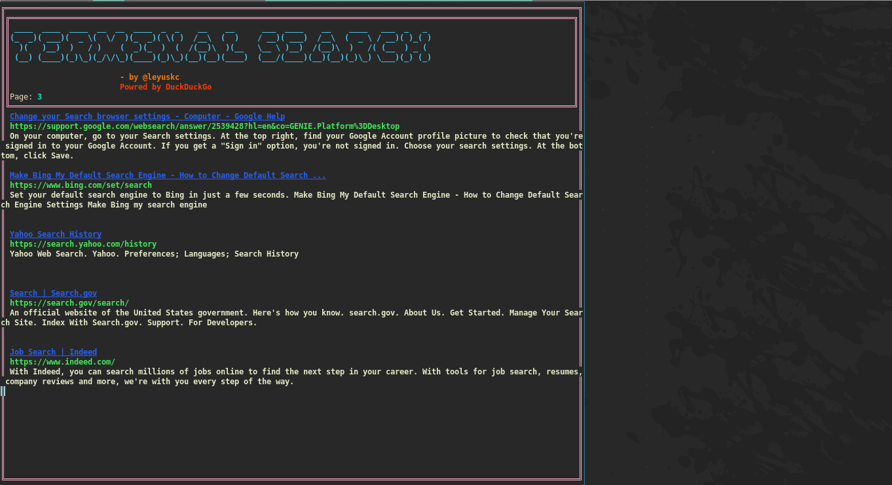
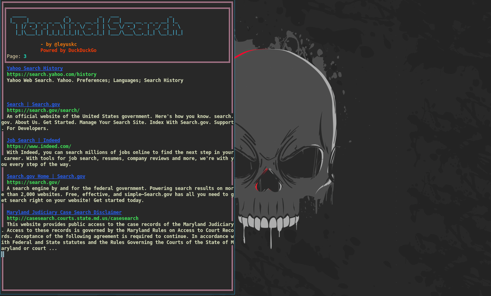

# terminalsearch
This is a CLi tools for devs focused on their productivity. It is fast, light weight and with just one additional module `beautifulsoup` you can do websearches from your terminal and experience different experience. And it responses with the terminal resized to the size of the image. So, you can view the image in the terminal itself. And it is also very fast, it just takes 0-1 seconds to search and display the results.


## Installation
```bash
pip install beautifulsoup4
git clone  https://github.com/leyuskckiran1510/terminalsearch.git
cd terminalsearch
python src/main.py
```

## Images [#](#images)





## Usage
```bash
terminalsearch
```
This will open up a terminal interface [Image](#images). This Sorcuts are available as of now:
- `q` to quit the program
- `\` to search the query
- `w` to scroll the results up
- `s` to scroll the results down
- `wwww...`to go to next page (press continiously untill you reach top of current page result)
- `ssss...` to go to previous page (press continiously untill you reach end of first page result)
- `n` to go to next_page of duckduckgo result
- `p` to go to previous page of duckduckgo result
- `1` to go to the first link what is visible
- `2` to go to the second link what is visible
- `3` to go to the third link what is visible
- `4` to go to the fourth link what is visible
- `5` to go to the fifth link what is visible
- `6` to go to the sixth link what is visible
### The numerics will load the page and show you only the text of that page and it also follows the same shortcuts as   above. 
    - 1,2,3.. to click on 1st,2nd... visible links, this will take you to browser it can't go any deeper[in futer maybe]
    - w,s to scroll up and down
    - b to go back to search_result page
    - q to quit the program
    - \ to search text on the current shown page, it will search in buffers to and will highlight it.
    - y to save the visible text into a file
    - t to save total/whole page as text into file
    [pending...]
    - h to save html of the page into file
    - d to download the image from the page and if `feh` is present then you can integrate it to show image with feh 
    - v to download videos if possible and parse the page for videos; if you have ffplay/ffmpeg we can play the video in the terminal itself or stream it without downloading it.

## Contributing
Pull requests are welcome. For major changes, please open an issue first to discuss what you would like to change.

## License
[MIT](./LICENSE)

## Author
[Leyuskc](https://github.com/leyuskckiran1510)
